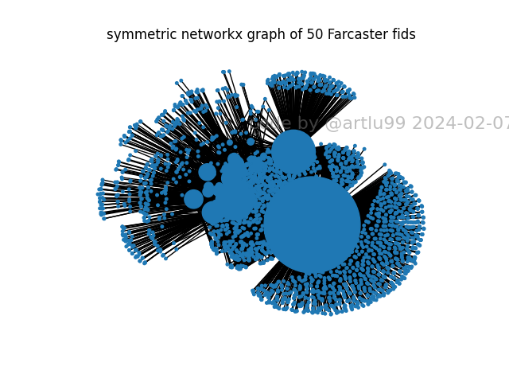
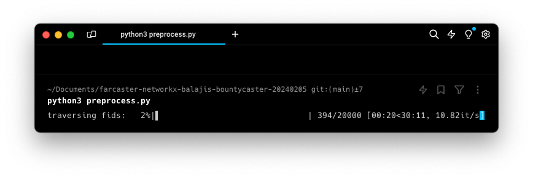
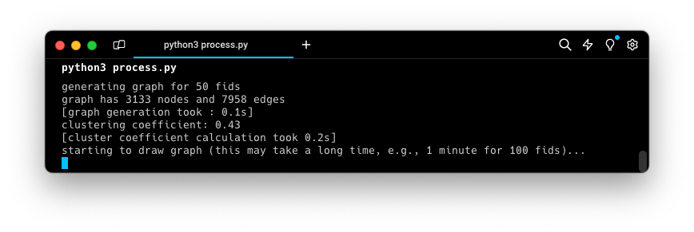

command line script that downloads the full Farcaster social graph and renders it in networkx.

# Farcaster 🤝 networkx 🤝 balajis 🤝 bountycaster

on 5 Feb 2024, @balajis funded a @bountycaster [bounty](https://warpcast.com/balajis.eth/0x16771738) to show the power of decentralized social media.

$100 in ETH for a command line script that downloads the full Farcaster social graph and renders it in networkx.

This can’t be done on Twitter without API key as the backend isn’t open — unlike Farcaster!

@bountybot

---


--- 
### Step 0. install `fario` by [@vrypan.eth](https://warpcast.com/vrypan.eth)

- FOSS Farcaster command-line tools at [https://github.com/vrypan/fario](https://github.com/vrypan/fario) (MIT License)
    - on MacOS, simplest method is `brew install fario`
    - on Linux, try `pip install fario`
- The `fario` documentation provides examples of how to specify a Hub.
    - `fario-config make` creates a configuration. Save it to `~/.fario`.
    - The code below expects the Hub address to be stored in the local config file.
    - It may be amended to specify the Hub address as a command-line option, or to point to a load balancer, as exercises left for the reader.

### Step 1. find a Hub

 *as of February 2024*:
 
- [Run your own](https://thehubble.xyz) Hub, like >1,000 others [[Viewer](https://farcaster.spindl.xyz) by [@zachterrell](https://warpcast.com/zachterrell/0x074fe069)].
- [Farcaster](https://docs.farcaster.xyz/learn/architecture/hubs) runs free, read-only Hubs. These are used by much of the community to handle validations required for many Frames actions, and sometimes come under heavy load.
- [Neynar](https://neynar.xyz) runs paid, read-only and read-write Hubs. These are very powerful, and also used by much of the community.
- the community operates several free, open Hubs (read-only + read-write): including Standard Crypto, [Wield/FarQuest](https://docs.wield.co/farcaster/api) (search for "free public hub"), [Pinata](https://www.pinata.cloud/pinata-hub), and [@farcasteradmin.eth](https://freefarcasterhub.com).
- [foss-farchiver](https://foss.farchiver.xyz) by @farchiver maintains a growing open source, distributed list of Hubs, along with viewers and API endpoints to assist with load balancing.

### Step 2. Pre-process

- All follows are stored on the permissionless, decentralized Hub network. It is a network and a protocol, not a blockchain!
- Getting follows from the network can be quick if you already have them.
    - e.g., inside a live Replicator which includes a Postgres database instance.
    - Neynar (paid) and Wield (free, more rate-limited) provide APIs to access their databases.
- anybody can permissionlessly pull the data from Hub(s), by calling the Hub APIs to loop through individual FIDs.

```
> python3 preprocess.py
```

- loop through a range of FIDs and store follows in a local `sqlite3` database.
- the code is ~50 lines. Comments contain more guidance.



### Step 3. Process

- once we download the data, create the social graph in `networkx` and display it.

```
> python3 process.py
```

- loop through a range of FIDs, create nodes and edges, and produce a sample visualization.
- the code is ~70 lines. Comments contain more guidance.



### Step 4. Outputs

- display some calculated network stats, and some timing indications.
- save PNG files in the `out/` folder.
- update the variable `MAX_FID_WHILE_DEBUGGING` around line 13 when all looks good, and you are ready to do larger processing.

